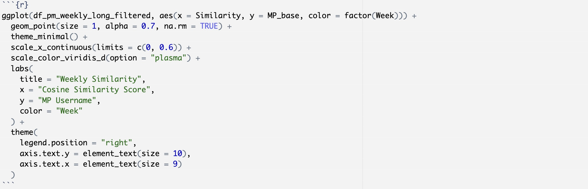
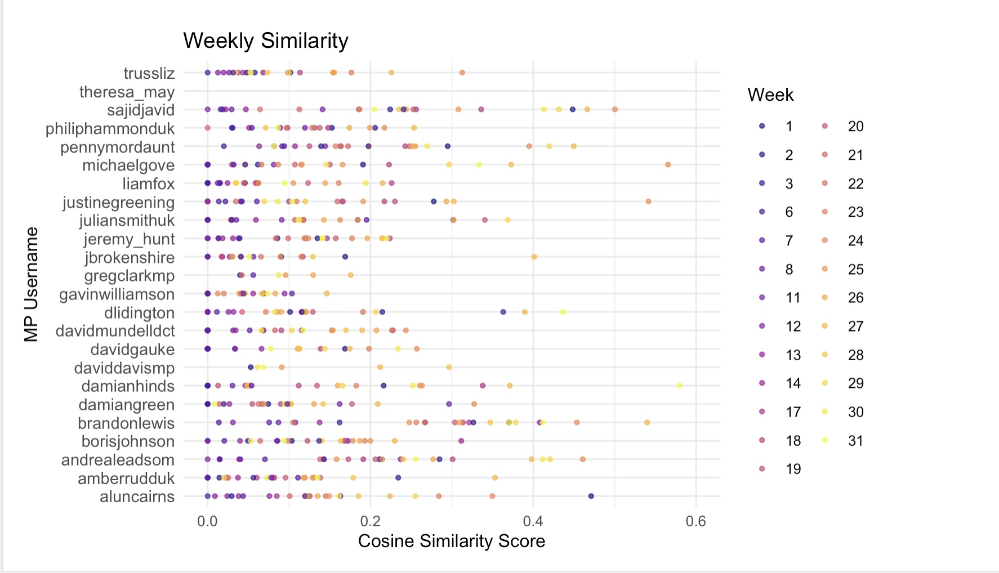

## Introduction

The hands-on exercise for this week focuses on: 1) comparing texts; 2) measuring the document-level characteristics of text---here, complexity.

In this tutorial, you will learn how to:
  
* Compare texts using character-based measures of similarity and distance
* Compare texts using term-based measures of similarity and distance
* Calculate the complexity of texts
* Replicate analyses from @schoonvelde_liberals_2019

## Setup 

Before proceeding, we'll load the remaining packages we will need for this tutorial.

```{r}
library(kableExtra)
```

```{r, message=F}
library(readr) # more informative and easy way to import data
library(quanteda) # includes functions to implement Lexicoder
library(quanteda.textstats) # for estimating similarity and complexity measures
library(stringdist) # for basic character-based distance measures
library(dplyr) #for wrangling data
library(tibble) #for wrangling data
library(ggplot2) #for visualization
```


For this example we'll be using data from the 2017-2018 Theresa May Cabinet in the UK. The data are tweets by members of this cabinet. 

```{r}
tweets  <- readRDS(gzcon(url("https://github.com/cjbarrie/CTA-ED/blob/main/data/comparison-complexity/cabinet_tweets.rds?raw=true")))
```

And we see that the data contain three variables: "username," which is the username of the MP in question; "tweet," which is the text of the given tweet, and "date" in days in yyyy-mm-dd format. 

```{r}
head(tweets)
```

And there are 24 MPs whose tweets we're examining. 

```{r}
unique(tweets$username) 

length(unique(tweets$username)) 
```

## Generate document feature matrix

In order to use the `quanteda` package and its accompanying `quanteda.textstats` package, we need to reformat the data into a quanteda "corpus" object. To do this we just need to specify the text we're interested in as well as any associated document-level variables in which we're interested. 

We can do this as follows. 

```{r}
#make corpus object, specifying tweet as text field
tweets_corpus <- corpus(tweets, text_field = "tweet")

#add in username document-level information
docvars(tweets_corpus, "username") <- tweets$username

tweets_corpus
```

We are now ready to reformat the data into a document feature matrix.

```{r}
dfmat <- dfm(tokens(tweets_corpus, remove_punct = TRUE)) %>%
  dfm_remove(pattern = stopwords("english"))
```

Note that when we do this we need to have tokenized our corpus object first. We can do this by wrapping the `tokens` function inside the `dfm()` function as above. 

So what is this object? Well the documents here are tweets. And the matrix is a sparse (i.e., mostly zeroes) matrix of 1s and 0s for whether a given word appears in the document (tweet) in question. 

The vertical elements (columns) of this vector are made up of all the words used in all of the tweets combined. Here, it helps to imagine every tweet positioned side by side to understand what's going on here. 

## Compare between MPs

Once we have our data in this format, we are ready to compare between the text produced by members of Theresa May's Cabinet.

Here's an example of the correlations between the combined tweets of 5 of the MPs with each other.

```{r}
corrmat <- dfmat %>%
  dfm_group(groups = username) %>%
  textstat_simil(margin = "documents", method = "correlation")

corrmat[1:5,1:5]

```

Note that here we're using the `dfm_group()` function, which allows you to take a document feature matrix and make calculations while grouping by one of the document-level variables we specified above. 

There are many different measures of similarity, however, that we might think about using.

In the below, we combine four different measures of similarity, and see how they compare to each other across MPs. Note that here we're looking only at the similarity between an MP's tweets and those of then Prime Minister, Theresa May.

## Compare between measures

Let's see what this looks like for one of these measures---cosine similarity.

We first get similarities between the text of MP tweets and all other MPs.

```{r}

#estimate similarity, grouping by username

cos_sim <- dfmat %>%
  dfm_group(groups = username) %>%
  textstat_simil(margin = "documents", method = "cosine") #specify method here as character object

```

But remember we're only interested in how they compare to what Theresa May has been saying. 

So we need to take these cosine similarities and retain only those similarity measures corresponding to the text of Theresa May's tweets. 

We first convert the `textstat_simil()` output to a matrix.

```{r}

cosmat <- as.matrix(cos_sim) #convert to a matrix
  
```

And we can see that the 23rd row of this matrix contains the similarity measures with the Theresa May tweets. 

We take this row, removing the similarity of Theresa May with herself (which will always = 1), and convert it to a datframe object. 

```{r}
#generate data frame keeping only the row for Theresa May
cosmatdf <- as.data.frame(cosmat[23, c(1:22, 24)])
```

We then rename the cosine similarity column with an appropriate name and convert row names to a column variable so that we have cells containing information on the MP to which the cosine similarity measure refers. 

```{r}
#rename column
colnames(cosmatdf) <- "corr_may"
  
#create column variable from rownames
cosmatdf <- tibble::rownames_to_column(cosmatdf, "username")
```

And so we have our data in tidy format, which we can then plot like so. 

```{r}
ggplot(cosmatdf) +
  geom_point(aes(x=reorder(username, -corr_may), y= corr_may)) + 
  coord_flip() +
  xlab("MP username") +
  ylab("Cosine similarity score") + 
  theme_minimal()

```

Combining these steps into a single `for` loop, we can see how our different similarity measures of interest compare. 

```{r}

#specify different similarity measures to explore
methods <- c("correlation", "cosine", "dice", "edice")

#create empty dataframe
testdf_all <- data.frame()

#gen for loop across methods types
for (i in seq_along(methods)) {
  
  #pass method to character string object
  sim_method <- methods[[i]]
  
  #estimate similarity, grouping by username
  test <- dfmat %>%
    dfm_group(groups = username) %>%
    textstat_simil(margin = "documents", method = sim_method) #specify method here as character object created above
  
  testm <- as.matrix(test) #convert to a matrix
  
  #generate data frame keeping only the row for Theresa May
  testdf <- as.data.frame(testm[23, c(1:22, 24)])
  
  #rename column
  colnames(testdf) <- "corr_may"
  
  #create column variable from rownames
  testdf <- tibble::rownames_to_column(testdf, "username")
  
  #record method in new column variable
  testdf$method <- sim_method

  #bind all together
  testdf_all <- rbind(testdf_all, testdf)  
  
}

#create variable (for viz only) that is mean of similarity scores for each MP
testdf_all <- testdf_all %>%
  group_by(username) %>%
  mutate(mean_sim = mean(corr_may))

ggplot(testdf_all) +
  geom_point( aes(x=reorder(username, -mean_sim), y= corr_may, color = method)) + 
  coord_flip() +
  xlab("MP username") +
  ylab("Similarity score") + 
  theme_minimal()

```

## Complexity

We now move to document-level measures of text characteristics. And here we will focus on the paper by @schoonvelde_liberals_2019. 

We will be using a subset of these data, taken from EU speeches given by four politicians. These are provided by the authors at [https://dataverse.harvard.edu/dataset.xhtml?persistentId=doi:10.7910/DVN/S4IZ8K](https://dataverse.harvard.edu/dataset.xhtml?persistentId=doi:10.7910/DVN/S4IZ8K).

We can load the data as follows.

```{r}

speeches  <- readRDS(gzcon(url("https://github.com/cjbarrie/CTA-ED/blob/main/data/comparison-complexity/speeches.rds?raw=true")))

```

And we can take a look at what the data contains below.

```{r, include=FALSE}

head(speeches)

```

The data contain speeches by four different politicians, each of whom are positioned at different points on a liberal-conservative scale.

We can then calculate the Flesch-Kincaid readability/complexity score with the `quanteda.textstats` package like so.

```{r}
speeches$flesch.kincaid <- textstat_readability(speeches$text, measure = "Flesch.Kincaid")

# returned as quanteda data.frame with document-level information;
# need just the score:
speeches$flesch.kincaid <- speeches$flesch.kincaid$Flesch.Kincaid
```

We want this information aggregated over each of our politicians: Gordon Brown, Jose Zapatero", David Cameron, and Mariano Rajoy. These are recorded in the data under a column called "speaker."

```{r}
#get mean and standard deviation of Flesch-Kincaid, and N of speeches for each speaker
sum_corpus <- speeches %>%
  group_by(speaker) %>%
  summarise(mean = mean(flesch.kincaid, na.rm=TRUE),
                   SD=sd(flesch.kincaid, na.rm=TRUE),
                   N=length(speaker))

# calculate standard errors and confidence intervals
sum_corpus$se <- sum_corpus$SD / sqrt(sum_corpus$N)
sum_corpus$min <- sum_corpus$mean - 1.96*sum_corpus$se
sum_corpus$max <- sum_corpus$mean + 1.96*sum_corpus$se
```

And this gives us data in tidy format that looks like so. 

```{r}
sum_corpus
```

Which we can then plot---and we see that our results look like those in Figure 1 of the published article by @schoonvelde_liberals_2019. 


```{r}

ggplot(sum_corpus, aes(x=speaker, y=mean)) +
  geom_bar(stat="identity") + 
  geom_errorbar(ymin=sum_corpus$min,ymax=sum_corpus$max, width=.2) +
  coord_flip() +
  xlab("") +
  ylab("Mean Complexity") + 
  theme_minimal() + 
  ylim(c(0,20))

```

## Exercises

1. Compute distance measures such as "euclidean" or "manhattan" for the MP tweets as above, comparing between tweets by MPs and tweets by PM, Theresa May. 

N4M: Block distance, or manhattan distance, computes distance to travel from one data point to another if a grid-like path is followed (assuming this is Manhattan bc of street setup, how cute). euclidean distance L2 distance, square root of sum of squared differences between corresponding elements of the 2 vectors [from A survey of text similarity approaches by Gomma & Fahmy] 🤠

```{r}
#group dfm by username 
dfmat_grouped <- dfm_group(dfmat, groups = username) 
#euclidean distance bc it reminds me of Epicurus if i glance quickly & i like that
euclidean_dist <- textstat_dist(dfmat_grouped, method = "euclidean")
```
fun wait this may be wrong

```{r}
distmat <- dfmat %>%
  dfm_group(groups=username) %>%
  textstat_dist(margin = "documents", method = "euclidean")

distmat[23, c(1:22,24)]
```
i guess i can check if this is right by including 23 (#lebron) in this & checking it is 0. oh boy. Quanteda for the win (N4M if you ever look at this exercise for example: https://quanteda.io/reference/textstat_simil.html)

```{r}
distmat <- dfmat %>%
  dfm_group(groups=username) %>%
  textstat_dist(margin = "documents", method = "euclidean")

distmat[23, c(1:24)]
```
#hooray! 

2. Estimate at least three other complexity measures for the EU speeches as above. Consider how the results compare to the Flesch-Kincaid measure used in the article by @schoonvelde_liberals_2019.

TTR (Type token ratio) search for unique words, MLU (mean length of utterance), MLW (mean length of word)

```{r TTR}
speech_corpus <- corpus(speeches, text_field = "text")
docvars(speech_corpus, "speaker") <- speeches$speaker

speech_tokens <- tokens(speech_corpus, remove_punct = FALSE)
speech_dfm <- dfm(speech_tokens)
ttr_results <- textstat_lexdiv(speech_dfm, measure = "TTR")
speeches$TTR <- ttr_results$TTR

TTR_corpus <- speeches %>% 
  group_by(speaker) %>%
  summarise (
    mean=mean(TTR, na.rm=TRUE),
    SD=sd(TTR, na.rm=TRUE),
    N=n()
  ) %>%
  mutate(
    se=SD/sqrt(N),
    min=mean-1.96*se,
    max=mean+1.96*se
  )

head(TTR_corpus)
```

#hooray! 

```{r TTR plot}
ggplot(TTR_corpus, aes(x=speaker, y=mean, fill=speaker)) +
  geom_bar(stat="identity") +
  geom_errorbar(ymin=TTR_corpus$min, ymax=TTR_corpus$max, width=.1) +
  coord_flip() + 
  xlab("Speaker") +
  ylab("TTR Mean Complexity")+
  theme_minimal()+
  ylim(c(0,0.5))
```

```{r MLW}
speech_corpus <- corpus(speeches, text_field="text")
docvars(speech_corpus, "speaker") <- speeches$speaker

speeches$MLW <- sapply(strsplit(speeches$text, " "), function(words) mean(nchar(words)))

mlw_corpus <- speeches %>% 
  group_by(speaker) %>%
  summarise(
    mean=mean(MLW, na.rm=TRUE),
    SD=sd(MLW, na.rm=TRUE),
    N=n()
  ) %>%
  mutate(
    se=SD/sqrt(N),
    min=mean-1.96*se,
    max=mean+1.96*se
  )

print(mlw_corpus)
```

```{r MLW plot}
ggplot(mlw_corpus, aes(x=speaker, y=mean, fill=speaker)) +
  geom_bar(stat="identity") +
  geom_errorbar(ymin=mlw_corpus$min, ymax=mlw_corpus$max, width=0.5) +
  coord_flip() +
  xlab("Speaker") +
  ylab("MLW Mean Complexity") +
  theme_minimal()+
  ylim(c(0,6))
  
```
```{r MLU}
speech_corpus<- corpus(speeches, text_field = "text")
docvars(speech_corpus, "speaker") <- speeches$speaker

#THIS is what i kept messing up--got means in the thousands for a long time
speeches$utterances <- strsplit(speeches$text, "(?<=[.!?])\\s+", perl=TRUE) 

speeches$MLU <- sapply(speeches$utterances, function(utt) mean(sapply(strsplit(utt, " "), length)))

mlu_corpus <- speeches %>% 
  group_by(speaker) %>%
  summarise(mean=mean(MLU, na.rm = TRUE),
            SD=sd(MLU, na.rm = TRUE),
            N=n()) %>%
  mutate(
    se=SD/sqrt(N),
    min=mean-1.96*se,
    max=mean+1.96*se
  )
  
print(mlu_corpus)
```

```{r MLU plot}
ggplot(mlu_corpus, aes(x=speaker, y=mean, fill=speaker)) + 
  geom_bar(stat= "identity") +
  geom_errorbar(ymin=mlu_corpus$min, ymax=mlu_corpus$max, width=0.5) +
  coord_flip() +
  xlab("Speaker") +
  ylab("MLU Mean Complexity") +
  theme_minimal()+
  ylim(0,35)

```

3. (Advanced---optional) Estimate similarity scores between the MP tweets and the PM tweets for each week contained in the data. Plot the results. 

I do love a challenge, lets begin 
```{r starting from scratch}
tweets_weeks<- readRDS(gzcon(url("https://github.com/cjbarrie/CTA-ED/blob/main/data/comparison-complexity/cabinet_tweets.rds?raw=true")))

head(tweets_weeks)  
```
```{r assign weeks}
library(dplyr)
library(lubridate)
tweets_weeks<-tweets_weeks %>%
  mutate(week = as.integer(difftime(date, min(date), units="weeks")) + 1)
head(tweets_weeks)
```
```{r, include=FALSE}
if (!exists("weekly_texts")) {
  weekly_texts <- data.frame(username = character(), week = integer(), text = character(), stringsAsFactors = FALSE)
}
```

```{r week dataset}
library(tidyr)
all_weeks<- expand_grid(
  username = unique(tweets_weeks$username),
  week=unique(tweets_weeks$week)
)
weekly_texts<-all_weeks %>%
  left_join(weekly_texts, by = c("username","week")) %>%
  mutate(text =ifelse(is.na(text), "",text)) 
```
```{r corpus & df}
library(quanteda)
tweets_corpus_weekly<-corpus(weekly_texts,text_field ="text")
docvars(tweets_corpus_weekly,"username")<- weekly_texts$username
docvars(tweets_corpus_weekly,"week")<-weekly_texts$week
dfmat_weekly<-dfm(tokens(tweets_corpus_weekly,remove_punct =TRUE)) %>%
  dfm_remove(pattern= stopwords("english"))
```


```{r cosine similarity}
docvars(dfmat_weekly,"grouping_var")<-paste0(docvars(dfmat_weekly, "username"),"_W",docvars(dfmat_weekly, "week"))
cos_sim_weekly<-dfmat_weekly %>%
  dfm_group(groups=grouping_var)%>%
  textstat_simil(margin = "documents",method="cosine")
cosmat_weekly<-as.matrix(cos_sim_weekly)

dim(cosmat_weekly)
```

```{r PM sim}
pm_weeks<-grep("^theresa_may_W",rownames(cosmat_weekly))
pm_weekly_sim<-cosmat_weekly[pm_weeks, ]
```

```{r long format}
df_pm_weekly<-as.data.frame(pm_weekly_sim)
df_pm_weekly$Week<-as.integer(gsub("^.*_W", "",rownames(pm_weekly_sim)))
df_pm_weekly<-df_pm_weekly %>%
  rownames_to_column(var = "Username")
df_pm_weekly_long<-tidyr::pivot_longer(df_pm_weekly, cols = -c(Username, Week), names_to = "MP", values_to = "Similarity")
head(df_pm_weekly_long)
```

```{r, include=FALSE}
df_pm_weekly$Week <- as.integer(df_pm_weekly$Week)
df_pm_weekly_long <- df_pm_weekly %>%
  tidyr::pivot_longer(cols = -c(Username, Week), names_to = "MP", values_to = "Similarity") %>%
  filter(as.integer(gsub("^.*_W", "", MP)) == Week)
head(df_pm_weekly_long)
```
 got into a huge fight with R because it keeps telling me that MP_base doesn't exist when I KNOW that it does so it will only knit until 97%. decided to just take out the problem code and put screenshot so I don't lose my mind
```{r, echo=FALSE, out.width="80%"}

```
 
```{r, echo=FALSE, out.width="80%"}

```
 